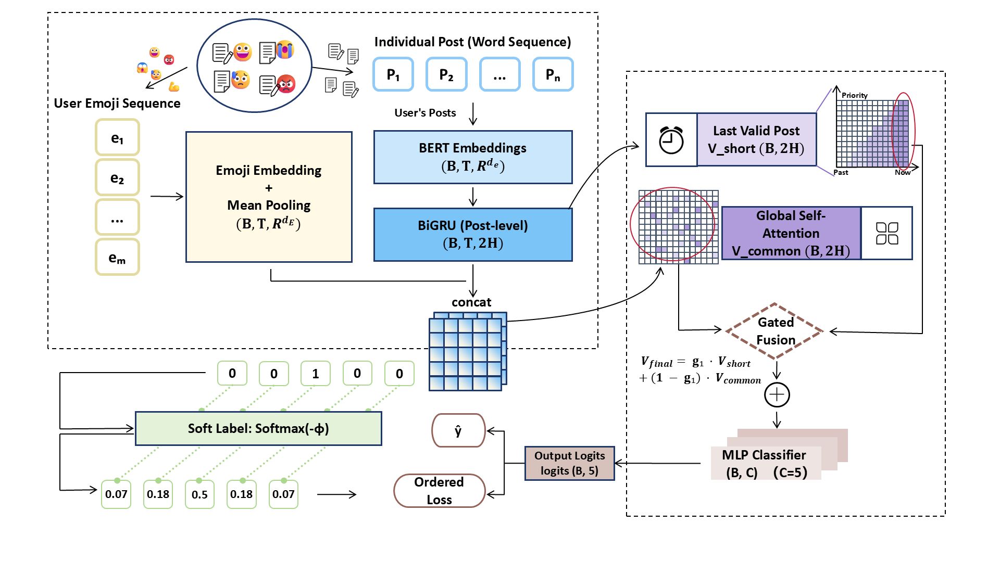

# Integrating Emoji Analysis: A Novel Suicide Risk Detection Framework with Historical Emotional Context and Emoji-Enhanced Cues in Understanding Users' Posts

[](https://arxiv.org/abs/XXXX.XXXXX) [](LICENSE) [](https://www.python.org/) [](https://pytorch.org/)

This is the official code release of the following paper:

**Integrating Emoji Analysis: A Novel Suicide Risk Detection Framework with Historical Emotional Context and Emoji-Enhanced Cues in Understanding Users' Posts**

---

## 📖 Abstract

**EmoCC** is a novel dual-modal hierarchical fusion model for suicide risk detection on social media, leveraging both textual content and emoji sequences to capture nuanced emotional expressions. By incorporating **Emoji-Enhanced Contextual Cues**, EmoCC can better understand users' implicit emotional states and improve suicide risk detection performance.

### Model Architecture

<p align="center">
  
</p>

EmoCC adopts a **dual-modal hierarchical fusion architecture**:

1. **Text Encoding Layer**: BERT embeddings → BiGRU (Post-level encoding), output shape `(B, T, 2H)`
2. **Emoji Encoding Layer**: Emoji2Vec embeddings → Mean Pooling, output shape `(B, T, dE)`
3. **Feature Fusion Layer**: Concatenation of text and emoji features
4. **Multi-view Extraction**:
   - **V_short**: Last valid post representation (local temporal feature)
   - **V_common**: Global Self-Attention (global emotional commonality)
5. **Adaptive Gate Fusion**: Gated fusion `V_final = g1·V_short + (1-g1)·V_common`
6. **Classification**: MLP classifier → 5-class suicide risk levels (0–4), with **Ordered Loss** for ordinal labels

---

## 📦 1. Installation

Install all dependencies:

```bash
conda create -n emocc python=3.8
conda activate emocc
pip install -r requirements.txt
```

**Requirements:** Python ≥ 3.8, PyTorch ≥ 1.13.0, CUDA recommended for GPU acceleration.

---

## 📦 2. Data Preparation

We provide **four datasets** for suicide risk detection. Each has two versions: original (without emoji) and emoji-enhanced. Datasets are available via the links in the repository or on request.

### Dataset Overview

| Dataset    | Language | #Users | #Posts   | Classes | Source           |
| ---------- | -------- | ------ | -------- | ------- | ---------------- |
| Reddit-500 | English  | 500    | ~9,000   | 5 (0–4) | Reddit           |
| SIGIR      | English  | 12,325 | ~12,325  | 2 (0–1) | SIGIR Dataset    |
| Weibo      | Chinese  | 7327   | ~467,291 | 2(0–1)  | Weibo            |
| BigData    | English  | 7,383  | ~36,915  | 4 (0–3) | BigData 2025 Cup |

---

## 🚀 3. Training & Evaluation

### Quick Start

```bash
python Emocc-setup.py \
  --mode train_test \
  --epochs 50 \
  --batch_size 16 \
  --dropout 0.5 \
  --lr 0.0005 \
  --gru_size 128 \
  --weight_decay 1e-6 \
  --patience 15 \
  --seed 24 \
  --use_pretrained_emoji
```

### Full Training Command

```bash
python Emocc-setup.py \
  --mode train_test \
  --seed 24 \
  --batch_size 16 \
  --lr 0.0005 \
  --gru_size 128 \
  --dropout 0.5 \
  --epochs 50 \
  --weight_decay 1e-6 \
  --patience 15 \
  --use_pretrained_emoji \
  --bert_pkl data/reddit_500_bert_embeddings.pkl \
  --emoji_csv data/reddit_500_emoji.csv \
  --emoji2vec_path pre-trained/emoji2vec.bin
```

**Parameter Description:**

- `--bert_pkl`: Path to BERT embeddings (`.pkl`)
- `--emoji_csv`: Path to emoji-annotated CSV
- `--emoji2vec_path`: Path to Emoji2Vec pre-trained weights (e.g. `emoji2vec.bin` or `emoji2vec.txt`)
- `--gru_size`: BiGRU hidden size (default 128)
- `--use_pretrained_emoji`: Use pre-trained Emoji2Vec weights

**📝 Note:** Modify `--bert_pkl`, `--emoji_csv`, and `--emoji2vec_path` to match your local data and pre-trained paths.

### Ablation Studies

```bash
bash run_ablation.sh
```

---

## 🤖 Text → Emoji Generation Pipeline (Optional)

We use **Alibaba Cloud Bailian Batch API** with **Qwen3-Max** to convert text posts into emoji sequences. Taking **Reddit-500** as an example:

The emoji generation pipeline uses a **Hybrid Prompting** approach with the following risk-level emoji mappings:

| Risk Level      | Emojis                      |
| --------------- | --------------------------- |
| **High Risk**   | 💀⚰️🔪💊🆘😰🌑🕳️💉🩸⚠️🚨 |
| **Medium Risk** | 😔💔😢😞😣😖😩            |
| **Low Risk**    | 😊😌💪✨🌟🙏💚🌈          |

**Core Rules:**
1. Output 3-5 emojis per post
2. Past suicidal behavior/thoughts = High Risk (regardless of current tone)
3. Extreme risk signals: tools (pills/knife/rope), time (tonight/today), actions (preparation/goodbye/notes)
4. Indirect signals: tired of life, burden to others, meaningless, can't hold on

```bash
# Prepare batch input → Submit → Check status → Download results (Reddit-500 example)
python reddit_emoji_generator.py prepare
python reddit_emoji_generator.py submit
python reddit_emoji_generator.py status
python reddit_emoji_generator.py result
```

---

## 📊 Experimental Results

### Reddit-500

| Model            | F-Score   | Accuracy | GP      | GR      |
| ---------------- | --------- | -------- | ------- | ------- |
| **EmoCC (Ours)** | **0.750** | **0.600** | **0.790** | **0.714** |

### SuicidEmoji

| Model            | F-Score   | Accuracy |
| ---------------- | --------- | -------- |
| **EmoCC (Ours)** | **0.882** | **0.955** |

### BigData 2025 Cup

| Model            | F-Score   | GP      | GR      | Weighted F-Score |
| ---------------- | --------- | ------- | ------- | ---------------- |
| **EmoCC (Ours)** | **0.696** | **0.695** | **0.697** | **0.506**        |


### Weibo

| Model            | F-Score | Accuracy |
| ---------------- | ------- | -------- |
| **EmoCC (Ours)** |         |          |

### Ablation Studies

| Variant                 | F-Score | Accuracy | GP    | GR    | OE    |
| ----------------------- | ------- | -------- | ----- | ----- | ----- |
| w/o Global Self-Attention | 0.630   | 0.460    | 0.740 | 0.550 | 0.220 |
| w/o Last Post           | 0.680   | 0.520    | 0.810 | 0.590 | 0.120 |
| w/o Emoji Feature       | 0.550   | 0.380    | 0.580 | 0.530 | 0.280 |
| w/o Text Feature        | 0.570   | 0.400    | 0.560 | 0.590 | 0.220 |
| Concat Fusion           | 0.730   | 0.580    | 0.740 | 0.720 | 0.160 |
| **Full Model**          | **0.750** | **0.600** | **0.790** | **0.714** | **0.120** |

---

## 📁 Directory Structure

```
EmoCC/
├── Emocc-setup.py                 # Main training script
├── Emocc_model/                   # Model code
│   ├── model.py                   # BertEmojiModel (core)
│   ├── utils/
│   │   ├── dataset.py             # Data loading
│   │   ├── emoji_utils.py         # Emoji processing
│   │   └── loss.py                # Loss functions (Ordered Loss)
│   └── checkpoints/                # Model checkpoints (generated)
├── ablation-model/                # Ablation experiments
│   ├── ablation-model.py
│   ├── ablation_results.csv       # Ablation experiment results
│   └── ablation_checkpoints/      # (generated)
├── data/                          # Datasets
│   ├── reddit_500.csv
│   └── reddit_500_emoji.csv
├── pre-trained/                   # Pre-trained weights
│   └── emoji2vec.bin              # or emoji2vec.txt
├── assets/                        # Figures (e.g. framework3.png)
├── requirements.txt
├── run_ablation.sh
└── README.md
```

---

## 📖 Data Format

**BERT Embeddings (`.pkl`):** List of dicts with `user`, `posts_embeddings` (Tensor `[T, 768]`), and `label`.

**Emoji CSV:** Columns `User`, `Post` (emoji sequence per post), `Label`.

---

## 🙏 Acknowledgement

We thank the following projects:

- **[BERT](https://github.com/google-research/bert)**: Pre-trained language model
- **[Emoji2Vec](https://github.com/uclnlp/emoji2vec)**: Emoji embeddings
- **[Alibaba Cloud Bailian](https://dashscope.aliyun.com/)**: Qwen3-Max API for emoji generation

---

## 📚 Citation

If you find our work useful, please cite:

```bibtex
@article{emocc2026,
  title={Integrating Emoji Analysis: A Novel Suicide Risk Detection Framework with Historical Emotional Context and Emoji-Enhanced Cues in Understanding Users' Posts},
  author={Author Name and Author Name and Author Name},
  journal={arXiv preprint arXiv:XXXX.XXXXX},
  year={2026}
}
```

---

## 📧 Contact

- **Email:** shengyp2011@163.com  
- **Institution:** Southwest University

---

## 📄 License

This project is licensed under the Apache 2.0 License — see the [LICENSE](LICENSE) file for details.
